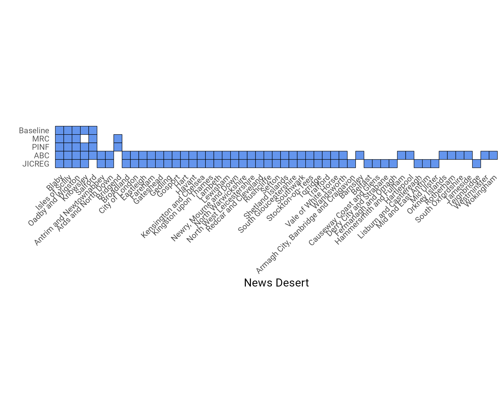

# Overview

This script was written as part of a research paper called: *Uncovering
the State of Local News Databases in the UK: Limitations and Impacts on
Research.* In this script, four datasets are merged, analysed and
compared: 1. ABC 2. JICREG 3. MRC 2023 4. PINF

The sections of this script include:

1.  Data processing

2.  Creation of novel dataset

3.  RQ1: RQ1a ; RQ1b

4.  RQ2

5.  RQ3: RQ3a;

6.  \+ RQ3b

## Libraries

This section loads the necessary R libraries for data processing and
analysis.

```{r setup, include=FALSE}
library(tidyverse)
library(googlesheets4)
library(readxl)
```

# Data processing

This section covers the data loading and preprocessing for the four
datasets, merging them into a unified dataset, and saving the resulting
data as a CSV file.

```{r}
# We are going to load the four datasets.

# mrc
mrc2023 <- 
  read_excel("MRC_2023.xlsx") %>%
  filter(`2023 owner` != "CLOSED/CONSOLIDATED") %>%
  filter(!Status %in% c("Closed", "CLOSED/CONSOLIDATED", "National")) %>% 
   mutate(
    Title = str_to_lower(Title),
    Title = str_replace_all(Title, "&", "and"),
    Title = gsub("[[:punct:]]", "", Title),
    Title = str_replace_all(Title, "  ", " "),
    Title = str_remove_all(Title, "the ")
  ) %>% 
  filter(!str_detect(Title, "bailiwick|isle of man|west country"))

# abc
abc <- 
  read_csv("ABC.csv") %>%
  pivot_wider(
    id_cols = c(1:9),
    names_from = c(PLATFORM, CATEGORY),
    names_sep = "_",
    values_from = `AVG. PER ISSUE`
  )

# jicreg
jicreg <- 
  read_excel("JICREG.xlsx")

# pinf
pinf <- 
  read_excel("Local news map - spreadsheet.xlsx") %>% 
  filter(!`Media Type` %in% 
           c("Community Radio","BBC Local Radio","Local TV Station")) %>% 
  filter(is.na(`Active/Closed`)|`Active/Closed`!="Closed") %>% 
   mutate(
    Title = str_to_lower(Title),
    Title = str_replace_all(Title, "&", "and"),
    Title = gsub("[[:punct:]]", "", Title),
    Title = str_replace_all(Title, "  ", " "),
    Title = str_remove_all(Title, "the ")
  )

# join all sources
sources <-
  list(pinf,
       mrc2023,
       jicreg,
       abc)

# keep only each unique dataset
names <- c("pinf",
           "mrc2023",
           "jicreg",
           "abc")

names(sources) <- names
list_names <- names(sources)

publications <- lapply(seq_along(sources), function(i) {
  # Initialize a data frame with all possible columns
  df <-
    data.frame(
      ID = NA,
      Publication = NA,
      Owner = NA,
      Area = NA
    )
  
  if (list_names[i] == "mrc2023") {
    df <- data.frame(
      ID = list_names[i],
      Publication = sources[[i]]$Title,
      Owner = sources[[i]]$`2023 owner`,
      Area = sources[[i]]$`LAD (; separated)`
    )
    
  } else if (list_names[i] == "abc") {
    df <- data.frame(
      ID = list_names[i],
      Publication = sources[[i]]$TITLE,
      Owner = sources[[i]]$OWNER,
      Area = sources[[i]]$AREA
    )
    
  } else if (list_names[i] == "jicreg") {
    df <- data.frame(
      ID = list_names[i],
      Publication = sources[[i]]$Publication,
      Owner = sources[[i]]$PUBLISHER_NAME,
      Area = NA
    )

    } else if (list_names[i] == "pinf") {
      df <- data.frame(
        ID = list_names[i],
        Publication = sources[[i]]$Title,
        Owner = sources[[i]]$Owner,
        Area = sources[[i]]$`LAD / Area Covered`
      )
  }
  return(df)
})

# rbind all dataframes together and make some minor string processing to harmonise different nomenclature styles (e.g., usage of & vs and, usage of 'the' vs lack of such usage), then create a column for each df and denote the presence of the observation in that df
publications_df <-
  do.call(rbind, publications) %>%
  distinct() %>% 
  mutate(presence = 1) %>%
  mutate(Publication = str_to_lower(Publication)) %>%
  mutate(
    Publication = str_to_lower(Publication),
    Publication = str_replace_all(Publication, "&", "and"),
    Publication = gsub("[[:punct:]]", "", Publication),
    Publication = str_replace_all(Publication, "  ", " "),
    Publication = str_remove_all(Publication, "the ")
  ) %>%
  pivot_wider(
    id_cols = c(Publication, Owner, Area),
    names_from = ID,
    values_fn = list(presence = sum),
    # Use sum to summarize duplicates
    values_from = presence
  ) %>%
  mutate_at(vars(jicreg, abc, mrc2023, pinf),
            ~ ifelse(is.na(.), 0, .)) %>%
  group_by(Publication) %>%
  summarise_all(list(
    sum = ~ if (is.numeric(.))
      sum(., na.rm = TRUE),
    var = ~ if (is.character(.))
      paste(., collapse = "; ")
  ))        

# save df to csv
write_csv(publications_df, "combined_them_no_pg_icnn.csv")
```

## Manual verification in Google Sheets

Upon saving the merged dataset as csv, I imported it into Google Sheets
and saved this under the sheet name "Stage 1 - long df with no
enhancements". This constitutes a long df with duplicate observations of
news outlets. At this point, I manually verified the existence of each
outlets and manually identified duplicate outlets with similar but not
exactly matching names.

## Enhancements

These are observations missing from these datasets that were found
through independent research. In this section, I add them to the main
dataset.

```{r}
# these are enhancements found through PG and ICNN
enhancements <- 
  read_csv("enhancements.csv")

# these are enhancements found elsewhere (e.g., news reports by HTFP)
enhancements2 <- 
  read_csv("enhancements_outside_pg_icnn.csv") %>%
  select(Publication, LAD, revision_outcome)
```

This section combines the enhancements with existing observations in a
Google Sheets document.

```{r}
# read the merged dataset now stored in Google Sheets in R
observations <-
  read_sheet(ss = "https://docs.google.com/spreadsheets/d/1pJARnWKVofKlYgGEp2Ow7-nyavJL20oJvEFlFRXdY_Y/edit?usp=sharing",
             sheet = "Stage 1 - long df with no enhancements")

# add both enhancements datasets to the merged df
observations_with_enhancements <- 
  enhancements %>%
  select(-Publication) %>%
  rename(Publication = New_publication) %>%
  full_join(observations, by = c("Publication", "revision_outcome")) %>%
  mutate_at(vars(pinf_sum, jicreg_sum, abc_sum, mrc2023_sum),
            ~ ifelse(is.na(.), 0, .)) %>%
  mutate(LAD = coalesce(LAD, `coverage LAD`)) %>%
  mutate(revision_outcome = if_else(is.na(revision_outcome), "ENHANCEMENT", revision_outcome)) %>%
  select(-`coverage LAD`) %>%
  full_join(enhancements2, by = c("Publication", "LAD", "revision_outcome")) %>%
  mutate_at(vars(pinf_sum, jicreg_sum, abc_sum, mrc2023_sum),
            ~ ifelse(is.na(.), 0, .))

# please don't overwrite
# write_sheet(observations_with_enhancements,
#     'https://docs.google.com/spreadsheets/d/1pJARnWKVofKlYgGEp2Ow7-nyavJL20oJvEFlFRXdY_Y/edit?usp=sharing', sheet = "Stage 1 - long df with enhancements"
#   )
```

## Merging duplicates

This section involves merging duplicates found in the manual
verification procedure outlined above and further cleaning the df (by
removing observations considered irrelevant due to being too large or
inappropriate). The resulting dataset contains the unique count of
outlets in the UK. The dataset has one row per outlet and one column
denoting the presence of that outlet in each original df.

```{r}
merged_duplicates <- 
  observations_with_enhancements %>%
  filter(!str_detect(revision_outcome, "irrelevant")) %>%
  mutate(New_publication = 
           case_when(!is.na(duplicate_of) ~ duplicate_of,
                                     .default = Publication)) %>%
  relocate(New_publication) %>%
  separate_rows(New_publication, sep = "\n") %>%
  mutate(New_publication = 
           case_when(!is.na(`rename to`) ~ `rename to`, 
                     .default = New_publication)) %>%
  mutate(New_publication = str_trim(New_publication, side = "both")) %>%
  group_by(New_publication) %>%
  summarise(across(everything(), 
                   ~ paste0(na.omit(.x), collapse = "; "))) %>%
  select(-`rename to`) %>%
  rowwise() %>%
  mutate(across(5:8, ~ sum(as.numeric(strsplit(., "; ")[[1]])))) 

# please don't overwrite
# write_sheet(merged_duplicates,
#     'https://docs.google.com/spreadsheets/d/1pJARnWKVofKlYgGEp2Ow7-nyavJL20oJvEFlFRXdY_Y/edit?usp=sharing', sheet = "Stage 2 - clean df with closures enhanced"
#   )
```

# Creation of novel dataset

This section includes data processing steps for creating a novel dataset
from the final dataset, followed by writing the data to Google Sheets.

```{r}
observations <-
  read_sheet(
    ss = "https://docs.google.com/spreadsheets/d/1pJARnWKVofKlYgGEp2Ow7-nyavJL20oJvEFlFRXdY_Y/edit?usp=sharing", sheet = "Stage 1 - long df with enhancements"
  )

final <- clean_df_with_closures %>%
  separate_rows(Publication, sep = "; ") %>%
  unique() %>%
  select(Publication, LAD, New_publication, revision_outcome) %>% 
  unique() %>%
  left_join(observations, by = c("Publication")) %>%
  rename(LAD = LAD.x, revision_outcome = revision_outcome.x) %>%
  select(
    Publication,
    New_publication,
    LAD,
    mrc2023_sum,
    pinf_sum,
    jicreg_sum,
    abc_sum,
    revision_outcome
  ) 

# please don't overwrite
# final %>% write_sheet(ss = "https://docs.google.com/spreadsheets/d/1pJARnWKVofKlYgGEp2Ow7-nyavJL20oJvEFlFRXdY_Y/edit#gid=1877276804", sheet = "Stage 3 - long df with lads")

# at this stage I have some overcounting so I fix that
final1 <- 
  final %>% 
  group_by(Publication) %>%
  summarise(across(everything(), ~paste0(na.omit(.x), collapse = "; ")))

# please don't overwrite
#final1 %>% write_sheet(ss = "https://docs.google.com/spreadsheets/d/1pJARnWKVofKlYgGEp2Ow7-nyavJL20oJvEFlFRXdY_Y/edit#gid=1877276804", sheet = "Stage 4 - long df with lads uniqued")

# now I manually fix numbers in the Stage 4 spreadsheet, where 0;0 turns into 0 and 1;1;1 into 1. This is because I had an issue with overcounting due to matching sub editions with the main title across datasets.

# Note, no point creating the baseline variable in the Stage 4 in google sheets, because duplicates have been separated, use Stage 2 for the novel dataset
```

# RQ1a

The aim of RQ1a was to measure the currentness of each df. To achieve
this, we avail of the information obtained about each outlet when
manually verifying the data in the section above about manual
verification. In that procedure, a column called "revision_outcome" was
created. If that column contains the word "closed" the outlet is
considered closed. To calculate the currentness, this formula was used:

*Currentness (%) = (1-Number Of Obsolete Titles In Dataset / Number Of
Titles In Dataset) \* 100*

```{r}
stage_4 <-  read_sheet(ss = "https://docs.google.com/spreadsheets/d/1pJARnWKVofKlYgGEp2Ow7-nyavJL20oJvEFlFRXdY_Y/edit#gid=1877276804", sheet = "Stage 4 - long df with lads uniqued")

currentness <- 
  stage_4 %>% 
  filter(str_detect(revision_outcome, "closed"))

closed <- 
  currentness %>% 
  select(pinf_sum, mrc2023_sum, jicreg_sum, abc_sum) %>%
  summarise_all(funs(sum))

total <- 
  final %>%
  mutate_at(vars(pinf_sum, mrc2023_sum, jicreg_sum, abc_sum), ~replace_na(.,0)) %>%
  select(pinf_sum, mrc2023_sum, jicreg_sum, abc_sum) %>%
  summarise_all(funs(sum)) 

currentness <- (1-closed/total)*100
```

# RQ1b

The aim of RQ1a was to measure the completeness of each df. Completeness
was measured as the extent to which a df contains the observations in
the novel dataset (given the novel dataset is wholly complete due to
merging all underlying datasets). The formula used here is:

*Completeness (%) = Number Of Titles In Dataset That Are Also Present In
The Novel Dataset / Number Of Titles In Novel Dataset \* 100*

```{r}
completeness <- stage_4 %>%
  filter(!str_detect(revision_outcome, "closed")) %>%
  mutate(Baseline = 1)

# Calculate the completeness of each column in a data frame.
completeness_function <- function(df) {
  # Create a vector to store the completeness scores.
  completeness_scores <- vector(length = ncol(df))

  # Create a vector to store the column names.
  column_names <- names(df)

  # Calculate the completeness of each column.
  for (i in 1:ncol(df)) {
    # Calculate the number of 1s in the column.
    num_ones <- sum(df[, i] == 1)

    # Calculate the completeness of the column.
    completeness_scores[i] <- num_ones / nrow(df) * 100
  }

  # Create a data frame to store the completeness scores and column names.
  completeness_df <- data.frame(
    column_name = column_names,
    completeness = completeness_scores
  )
  return(completeness_df)
}

completeness_scores <- completeness_function(completeness)
```

# RQ2

To assess dataset variations regarding research findings, this section
calculates the average news outlet presence across UK spatial units.
This section builds on Stage 4 for the four datasets, but Stage 2 for
the novel dataset. The reason for this is that Stage 4 correctly counts
the observations in each underlying df, which instead are slightly
skewed in Stage 2 (this is due to the fact the local editions are merged
together in Stage 2 but spread out in Stage 4, essentially harmonising
these differences across datasets). But Stage 2 is the df that correctly
has one row per news outlet, without duplicates. Using Stage 4 would
lead to overcounting for some of the datasets which did not consider
local sub-editions from the beginning.

```{r}
# a function to expand the LADs
expand_LADs <- function(input_df) {
  output_df <- separate_rows(input_df, "LAD", sep = "; ")
  return(output_df)
}

# Call the function on dataframe 'a'
LADS_long <- expand_LADs(stage_4)

# calculate LAD in each df
LADS_summed <- LADS_long %>%
  group_by(LAD) %>%
  summarise(
    abc_sum = sum(abc_sum),
    jicreg_sum = sum(jicreg_sum),
    mrc2023_sum = sum(mrc2023_sum),
    pinf_sum = sum(pinf_sum)
  )

# Calculate LAD in perfect df
baseline_lads <- clean_df_with_closures %>%
  filter(!str_detect(revision_outcome, "closed")) %>% 
  select(LAD) %>% 
  mutate(Baseline = 1) %>% 
  separate_rows("LAD", sep = "; ") %>% 
  count(LAD) %>%
  rename(baseline_sum = n)

# add missing districts
geo_LAD <-
  read_csv("files/october_23/Local_Authority_Districts_May_2023_UK_BFC_V2_-5976841950911842280.csv")

# merge DFs
LADs_counts <- full_join(LADS_summed, baseline_lads, by = "LAD") %>%
  mutate(baseline_sum = replace_na(baseline_sum, 0)) %>% 
  right_join(geo_LAD, by = c("LAD" = "LAD23NM")) %>%
  select(1:6) %>% 
  mutate_at(vars(pinf_sum, jicreg_sum, abc_sum, mrc2023_sum, baseline_sum), ~ifelse(is.na(.), 0, .)) 

library(psych)
describe(LADs_counts)

# number of LADs covered
result <- LADs_counts %>%
  summarize(across(everything(), ~ sum(. != 0)))

# please don't overwrite
# write_sheet(LADs_counts, ss = "https://docs.google.com/spreadsheets/d/1pJARnWKVofKlYgGEp2Ow7-nyavJL20oJvEFlFRXdY_Y/edit#gid=951138277", sheet = "LADs_outlet_counts")
```

In this section, we generate an histogram that shows the distribution of
LADs in terms of number of outlets within them, compared against the
novel dataset.

```{r}
library(scales)
library(ggokabeito)

baseline <- LADs_counts %>% 
  select(baseline_sum, LAD) 

library(ggthemes)
my_oka <- palette_okabe_ito(order = c(1, 2, 3, 5, 7), 
                            alpha = NULL)

p <- LADs_counts %>% 
  select(c(abc_sum, jicreg_sum, mrc2023_sum, pinf_sum, baseline_sum)) %>%
  rename(ABC = abc_sum, JICREG = jicreg_sum, MRC = mrc2023_sum, PINF = pinf_sum) %>% 
  pivot_longer(cols = c(1:4), names_to = "type", values_to = "n") %>% 
  mutate(n = replace_na(n,0)) %>% 
  ggplot() +
  geom_histogram(baseline, mapping = aes(x = baseline_sum, y = after_stat(count)),
                 bins = 30, alpha = 0.4,
                 fill = "gray40", linewidth = 0.5) +
  geom_histogram(mapping = aes(x = n, y = after_stat(count),
                               fill = type),
                 stat = "bin", bins = 30, size = 0.5,
                 alpha = 0.7) +
  scale_fill_okabe_ito() +
  scale_color_okabe_ito() +
  guides(color = "none", fill = "none") + 
  labs(x = "Outlets in Local Authority District", y = "Number of LADs") + 
  facet_wrap(~ type, nrow = 2, strip.position = "top")+
  theme_minimal(base_family = "Roboto") +
  theme(
    plot.background = element_rect(color = "white"),
    axis.title = element_text(size = rel(1)),
    axis.text = element_text(size = rel(1)),
    strip.text = element_text(hjust = 0, size = 12))

ggsave(filename = "results/Figure_4.png", plot = p, width = 15, height = 7, dpi = 300, units = "cm")
```


In this section, we generate a boxplot showing the distribution of the
per-LAD errors in estimating the number of local news outlets in a
district.

```{r}
error <- read_sheet(ss = "https://docs.google.com/spreadsheets/d/1pJARnWKVofKlYgGEp2Ow7-nyavJL20oJvEFlFRXdY_Y/edit#gid=1880677060", sheet = "LADs_outlet_counts")

# boxplot plot
q1 <- error %>%
  mutate(abc_diff = abc_sum - baseline_sum,
         jicreg_diff = jicreg_sum - baseline_sum, 
         mrc_diff = mrc2023_sum - baseline_sum,
         pinf_diff = pinf_sum - baseline_sum) %>% 
  select(c(abc_diff, jicreg_diff, mrc_diff, pinf_diff, baseline_sum)) %>%
  rename(ABC = abc_diff, JICREG = jicreg_diff, MRC = mrc_diff, PINF = pinf_diff) %>%
  pivot_longer(cols = c(1:4), names_to = "type", values_to = "n") %>%
  mutate(n = replace_na(n, 0)) %>%
ggplot(aes(x = type, y = n)) +
  #geom_violin(alpha = 0.7, scale = "count", trim = FALSE) +
  geom_boxplot(width = 0.5, outlier.size = 0.5) +
  labs(x = "Dataset", y = "Error per LAD") +
  scale_y_continuous(breaks = c(-15, -10, -5, 0, 5, 10))+
theme_minimal(base_family = "Roboto") +
  theme(
    plot.background = element_rect(color = "white"),
    axis.title = element_text(size = rel(1)),
    axis.text = element_text(size = rel(1)))

# save image
ggsave(filename = "results/Figure_5.png", plot = q1, width = 15, height = 7, dpi = 300, units = "cm")
```


Finally, pairwise Mann-Whitney U tests were conducted to determine
whether there were significant differences in the distribution of the
number of news outlets across LADs between pairs of two datasets.
It was chosen as Shapiro-Wilk tests showed that the distributions were
significantly non-normal for all datasets, including the novel dataset.
To determine which groups are statistically different from each
other, the adjusted p-values derived from the Mann-Whitney U test were
evaluated. Groups with adjusted p-values below a predetermined
significance level of 0.05 were considered statistically different from
each other.

```{r}
error %>%
  mutate(abc_diff = abc_sum - baseline_sum,
         jicreg_diff = jicreg_sum - baseline_sum, 
         mrc_diff = mrc2023_sum - baseline_sum,
         pinf_diff = pinf_sum - baseline_sum) %>% 
  select(c(abc_diff, jicreg_diff, mrc_diff, pinf_diff, baseline_sum)) %>%
  rename(ABC = abc_diff, JICREG = jicreg_diff, MRC = mrc_diff, PINF = pinf_diff) %>%
  pivot_longer(cols = c(1:4), names_to = "type", values_to = "n") %>%
  mutate(n = replace_na(n, 0)) %>% 
  ggplot(aes(x = n))+
  geom_histogram()+
  facet_wrap(~type)

# Format the data for an ANOVA test
data_anova <- error %>%
  pivot_longer(cols = c(2:6), names_to = "type", values_to = "n")

# Perform ANOVA
anova_result <- aov(n ~ type, data = data_anova)

# Print the ANOVA summary
summary(anova_result)

residuals_data <- residuals(anova_result)

plot(anova_result, 2)

# Perform the Shapiro-Wilk test
shapiro.test(residuals_data)

# Create a QQ plot of residuals
qqnorm(residuals_data)
qqline(residuals_data)

library(car)
leveneTest(n ~ type, data = data_anova)

kruskal.test(n ~ type, data = data_anova)

# Perform pairwise Wilcoxon rank-sum tests
pairwise_results <- pairwise.wilcox.test(data_anova$n, data_anova$type, p.adjust.method = "bonferroni")

library(rstatix)
mann_witney_test <- pairwise_wilcox_test(data_anova, n~type, ref.group = "baseline_sum") %>% 
  mutate(pair = paste(group1, group2)) #%>% 
  filter(str_detect(pair, "baseline"))
```

In this section, we see which districts are news deserts as per each
dataset.

```{r}
which_news_deserts <- 
  error %>%
  transmute(
    abc_zero = ifelse(abc_sum == 0, LAD, NA),
    jicreg_zero = ifelse(jicreg_sum == 0, LAD, NA),
    mrc2023_zero = ifelse(mrc2023_sum == 0, LAD, NA),
    PINF_zero = ifelse(pinf_sum == 0, LAD, NA),
    baseline_zero = ifelse(baseline_sum == 0, LAD, NA)) %>% 
  filter_all(any_vars(!is.na(.))) %>%
  rename(ABC = abc_zero, JICREG = jicreg_zero, MRC = mrc2023_zero, PINF = PINF_zero, Baseline = baseline_zero) %>% pivot_longer(cols = everything(), names_to = "df", values_to = "nd") %>%
  drop_na() %>%
  mutate(df = factor(df, levels = c("Baseline", "ABC", "JICREG", "MRC", "PINF"))) %>%
  group_by(nd) %>%
  mutate(n = n()) %>%
  ungroup()

q2 <- 
  which_news_deserts %>% 
  ggplot(aes(x = reorder(nd, -n), y = reorder(df, n)))+
  geom_tile(fill = "cornflowerblue", color = "black", size = 0.2)+
  coord_fixed(ratio = 1)+
theme_minimal(base_family = "Roboto") +
  theme(
    plot.background = element_rect(color = "white"),
    axis.title = element_text(size = rel(1)),
    axis.text = element_text(size = rel(0.7)))+
  labs(x = "News Desert", y = "")+
  theme(axis.text.x = element_text(angle = 45, vjust = 1, hjust=1),
        panel.grid = element_blank())

ggsave(filename = "results/Figure_3.png", plot = q2, width = 17, height = 14, dpi = 300, units = "cm")
```



# RQ3

Using the merged and enhanced Stage 2 data, I filter for the novel set,
and calculate missing entries and unique contributions.

```{r}
baseline <- clean_df_with_closures %>%
  filter(!str_detect(revision_outcome, "closed")) %>%
  mutate(Baseline = 1)

composition <-
  baseline %>% 
  select(1, 5:8) %>% 
  pivot_longer(cols = -1, names_to = "df", values_to = "value") %>% 
  mutate(value = case_when(value > 1  ~ 1, .default = value)) %>% 
  filter(value == 1) %>% 
  group_by(New_publication) %>% 
  mutate(sum = sum(value)) %>% 
  select(-value) %>% 
  group_by(New_publication, sum) %>% 
  summarise(df = paste(df, collapse = "; ")) %>% 
  ungroup() %>% 
  count(sum, df) %>%
  mutate(perc = round(n /nrow(baseline) * 100, 2))

distribution <- composition %>%
  group_by(sum) %>% summarise(perc = sum(perc)) %>%
  mutate(label_perc = paste(perc, "%")) %>%
  ggplot(aes(x = sum, y = perc)) + geom_bar(stat = "identity", fill = "cornflowerblue") +
  theme_minimal(base_family = "Roboto") +
  theme(
    plot.background = element_rect(color = "white"),
    axis.title = element_text(size = rel(1)),
    axis.text = element_text(size = rel(1))
  ) +  labs(x = "Number of datasets", y = "Percentage of of news outlets") +
  geom_text(aes(label = label_perc),
            stat = 'identity',
            nudge_y = 2)

# save image
ggsave(
  filename = "results/Figure_6.png",
  plot = distribution,
  width = 15,
  height = 7,
  dpi = 300,
  units = "cm"
)
```


```{r}
#RQ3b
unique_contributions <-
  baseline %>% select(-Baseline) %>% filter(rowSums(across(where(is.numeric))) == 1) %>%
  pivot_longer(cols = c(5:8),
               names_to = "df",
               values_to = "value") %>%
  filter(value == 1) %>%
  count(df) %>%
  mutate(perc = round(n / nrow(baseline) * 100, 2)) %>% select(-n)

#RQ3a
missing_entries <-
  completeness_scores %>% filter(completeness > 0) %>% mutate(missing = 100 -
                                                                completeness) %>% select(-completeness) %>% rename(df = 1) %>% filter(df != "Baseline")

currentness_df <-
  data.frame(df = colnames(currentness),
             currentness_score = as.numeric(as.vector(currentness[1, ])))

# merge these two metrics
missing_unique <-
  left_join(unique_contributions, missing_entries) %>%
  left_join(currentness_df) %>%
  mutate(
    df = case_match(
      df,
      "abc_sum" ~ "ABC",
      "jicreg_sum" ~ "JICREG",
      "mrc2023_sum" ~ "MRC",
      "pg_launches_sum" ~ "PG",
      "icnn_sum" ~ "ICNN",
      "pinf_sum" ~ "PINF"
    )
  ) %>%
  rename(Currentness = currentness_score) %>% filter(!df %in% c("ICNN", "PG"))

# visualise them
q5 <- ggplot(missing_unique, aes(x = missing, y = perc)) + geom_point(color = "black", size = 4, alpha = 0.6) +
  theme_minimal(base_family = "Roboto") +
  theme(
    plot.background = element_rect(color = "white"),
    axis.title = element_text(size = rel(1)),
    axis.text = element_text(size = rel(1))
  ) +  labs(x = "Percentage of missing entries", y = "Percentage of unique contributions") +
  geom_text(
    aes(label = df),
    stat = 'identity',
    nudge_x = c(-2, 2.5, 3, -3),
    nudge_y = c(-0.3, 0.3, 0.1, 0.1)
  ) 

# save image
ggsave(
  filename = "results/figure_7.png",
  plot = q5,
  width = 16,
  height = 7,
  dpi = 300,
  units = "cm"
)
```


